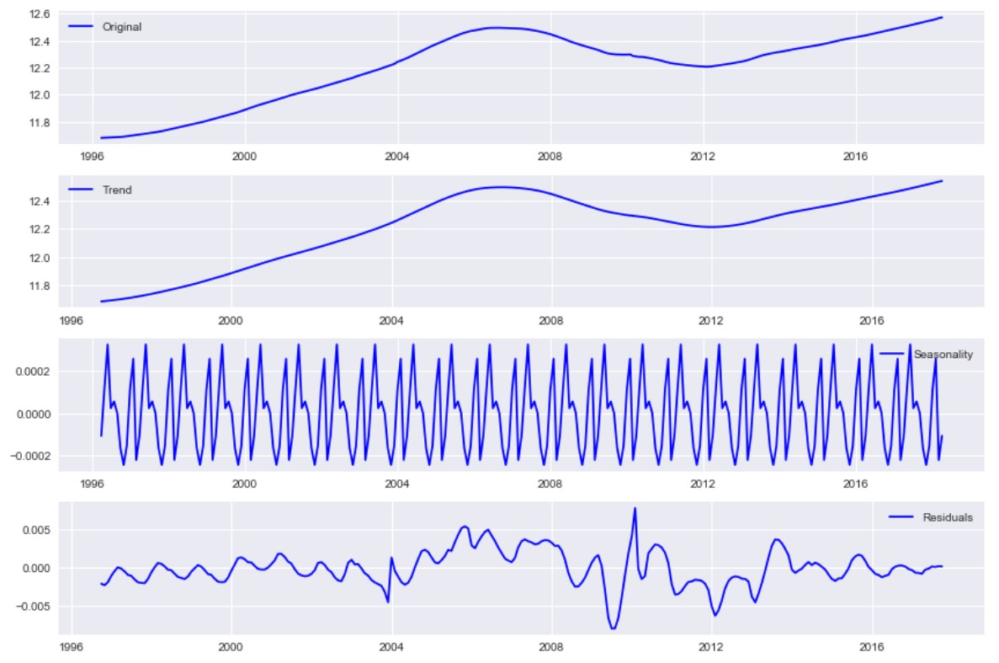
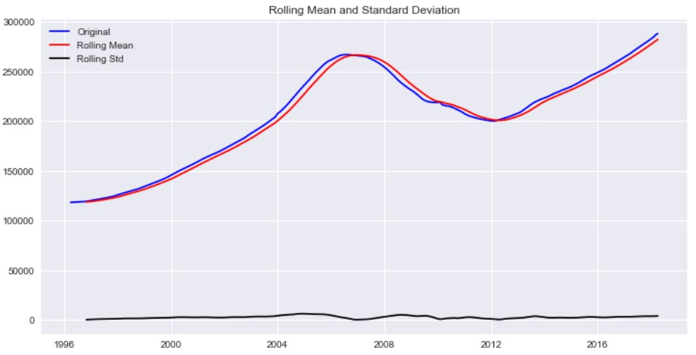
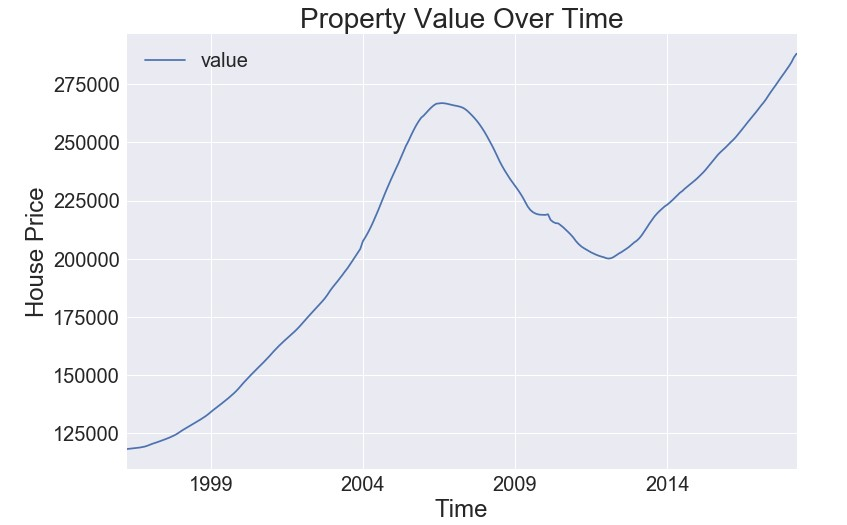
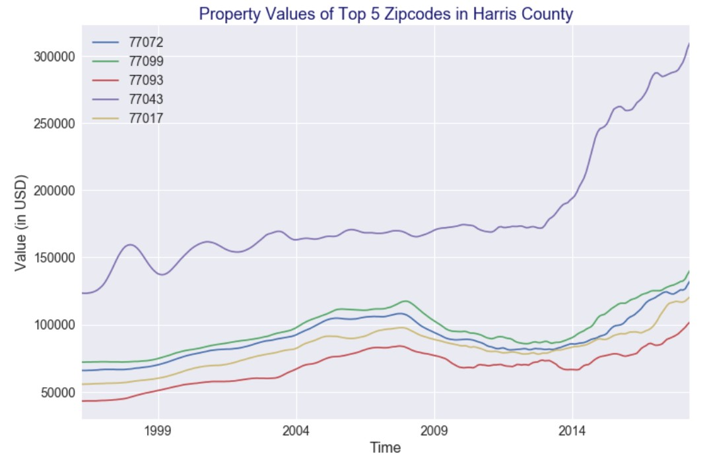

# TIME SERIES MODELING WITH ARIMA FOR HOUSE MARKET IN HARRIS COUNTY, TX

## Introduction

## Methodology
- Data Preprocessing
  * Reshape from wide to long format
  * Check for Trend, Seasonality, and Residuals
  
  * Check for Stationarity
  

- Data Exploration and Visualization

- Time Series Analysis and ARIMA Modeling
  Based on MSE and ROI yields

- Result Details of Top 5 Zip Codes in Harris County

## Content
- <a href="https://github.com/linhmai19/housing_time_series_modeling/blob/master/zillow_data.csv">Dataset from Zillow Research Page</a> 

- <a href="https://github.com/linhmai19/housing_time_series_modeling/blob/master/time_series_modeling.ipynb">Time Series Modeling</a>

## Presentation
- Presentation Slides: <a href="">Time Series Modeling Presentation</a>

- Oral Presenation: <a href="">Time Series Modeling Oral Presentation</a>

- Blog Post: <a href="">Time Series Modeling For House Market In Harris County, TX</a>

